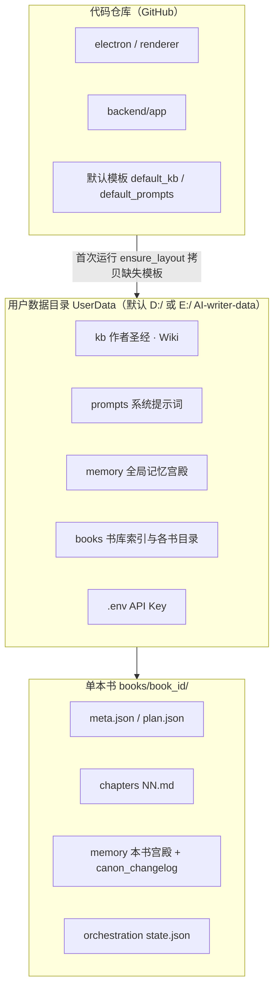
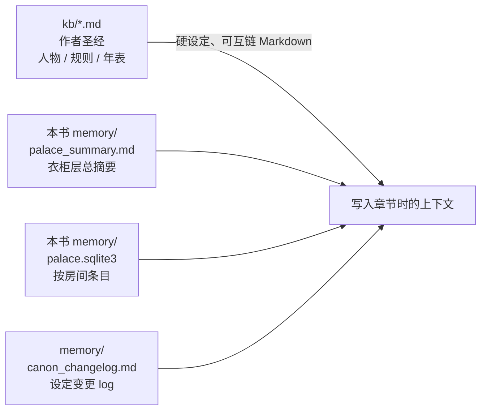
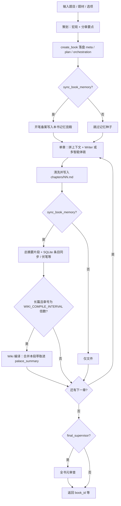
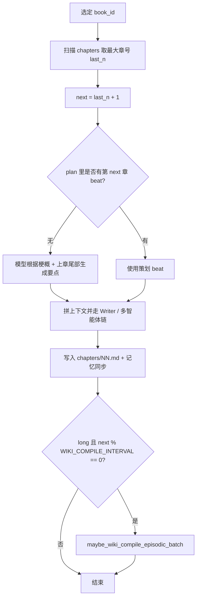
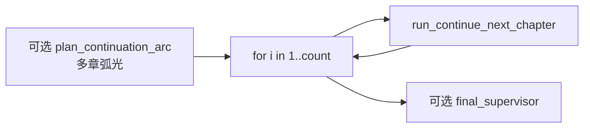
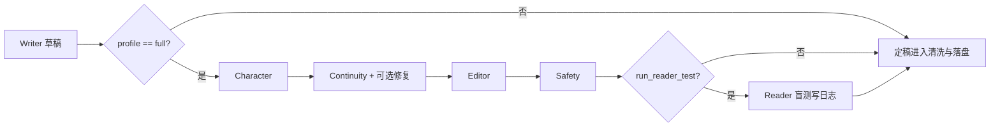

# AI Writer：项目结构、记忆宫殿、Wiki 与写作流程

本文说明**代码仓库**、**本机用户数据**、**单本书**三者的关系，以及「开新书 → 续写 → 记忆 / Wiki 协作」在流水线中的走向。文末单独说明**什么推送到 GitHub**、**书稿如何备份或开源**。

---

## 1. 三层结构总览



| 层级 | 路径（概念） | 作用 |
|------|----------------|------|
| 仓库 | 克隆的 `AI-writer/` | Electron + FastAPI **程序**；不含你的书稿与密钥 |
| 用户数据 | `…/UserData/`（可用 `AIWRITER_USER_DATA` 等覆盖） | 全局 `kb/`、`prompts/`、`memory/`、`books/` |
| 单本书 | `UserData/books/<book_id>/` | 本书策划、章节正文、本书记忆、编排状态 |

---

## 2. 知识库（Wiki / 作者圣经）与记忆宫殿的分工



- **`UserData/kb/`**（首次会从 `backend/app/default_kb/` 拷贝缺失文件）：长期、可人工编辑的「作者圣经」——人物卡、规则、时间线等；生成请求里可按勾选把摘录拼进模型上下文（见 `main.py` 中 `_kb_context_only` / `_build_user_with_kb`）。
- **本书 `memory/palace_summary.md`**：全书级压缩摘要（「衣柜层」），与 SQLite 条目一起在勾选「注入长期记忆」时进入 `build_memory_context`。
- **本书 `memory/palace.sqlite3`**：`memory_entries` 表，按「房间」存条目；流水线会在策划后写入开笔备案、每章后同步萃取等。
- **`memory/canon_changelog.md`**：长篇模式下，监督审查命中设定类 issue 时自动追加摘要，续写需与之兼容（见 `memory_wiki.append_canon_changelog_from_supervisor_review`）。

模块对应关系（便于查代码）：

| 概念 | 主要代码 |
|------|-----------|
| 记忆条目与总摘要 | `memory_store.py` |
| 伏笔块、语义检索开关等 | `memory_hooks.py`、`memory_relevance.py` |
| 每约 20 章合并萃取 → 总摘要 | `memory_wiki.py`（`maybe_wiki_compile_episodic_batch`） |
| 用户目录布局与默认 KB 拷贝 | `paths.py` → `ensure_layout` |

---

## 3. 开新书：一键全书流水线（`run_pipeline_from_title`）



要点：

- API 层为 `POST /api/pipeline/from-title`（前端「一键生成」对应该流程）。
- **`planned_total_chapters`** 可与本轮实际生成章数不同：策划会按「全书尺度」留白，正文仍按本轮 `max_chapters` 写。
- **长篇 `length_scale == "long"`** 且开启本书记忆时，每 **`WIKI_COMPILE_INTERVAL`（默认 20）** 章触发一次「Wiki 协作」侧的批量合并（`maybe_wiki_compile_episodic_batch`，见 `memory_wiki.py`）。

---

## 4. 续写：单章与多章

### 4.1 单章下一章（`run_continue_next_chapter`）



- API：`POST /api/pipeline/continue`（单章）等（详见 `PROJECT_STRUCTURE.md` API 摘要）。

### 4.2 多章续写（`run_continue_chapters`）



- 多章时可选 **`continuation_arc_plan`**：先做一次弧光级规划，再逐章续写，减少章节间漂移。

### 4.3 旧版平面章节（`out/*.md`）

- `run_continue_next_chapter_legacy_out`：兼容早期 `out/前缀_第NN章.md`，无 `books/` 注册表时的续写路径。

---

## 5. 多智能体链（与写作流程的关系）



实现见 `orchestration/runner.py` 中 `run_chapter_with_agents`。

---

## 6. 「写完后推送到 GitHub」指什么？

这是两类完全不同的东西，避免混淆：

| 内容 | 是否默认进 GitHub | 说明 |
|------|-------------------|------|
| **本仓库代码**（`electron/`、`backend/`、`renderer/` 等） | 是 | `git push` 推送的是你克隆的 **AI-writer 项目源码** |
| **书稿与用户数据**（`UserData/books/`、`kb/`、`.env`） | **否** | 默认在 `D:\AI-writer-data` 或 `E:\AI-writer-data`，**不在**仓库工作区里；**不要**把含 API Key 的 `.env` 提交到 Git |

若要把**某本书**公开或备份到 GitHub：

1. 新建**单独仓库**（或私有库），**不要**与含密钥的 UserData 混在一个未审查的提交里。  
2. 只拷贝需要的目录，例如 `books/<book_id>/chapters/`、`plan.json`（按需脱敏）、以及你愿意公开的 `kb` 摘录。  
3. 在**新仓库**里 `git init` → `git add` → `commit` → `push`。

若你修改了 **应用本身**（例如改了 `README`、后端、前端），则在 **AI-writer** 仓库根目录照常：

```bash
git add -A
git status   # 确认没有 .env 或整盘 UserData
git commit -m "docs: 架构与流程说明"
git push origin master
```

---

## 7. 延伸阅读

- 目录级文件说明：[PROJECT_STRUCTURE.md](../PROJECT_STRUCTURE.md)  
- 快速安装与运行：[README.md](../README.md)
